# ToonShark 사용 매뉴얼

---

## 목차

1. [소개](#1-소개)
2. [설치 및 실행](#2-설치-및-실행)
3. [홈 화면](#3-홈-화면)
4. [워크스페이스](#4-워크스페이스)
   - [PDF 탭](#41-pdf-탭)
   - [옵션 패널](#42-옵션-패널)
   - [결과 패널](#43-결과-패널)
5. [슬라이스 모드](#5-슬라이스-모드)
   - [자동 모드](#51-자동-모드)
   - [고정 모드](#52-고정-모드)
6. [작업 상세 페이지](#6-작업-상세-페이지)
7. [슬라이스 뷰어](#7-슬라이스-뷰어)
8. [썸네일 캡처](#8-썸네일-캡처)
9. [기기 미리보기](#9-기기-미리보기)
10. [에피소드 내보내기](#10-에피소드-내보내기)
11. [설정](#11-설정)
    - [언어](#111-언어)
    - [테마](#112-테마)
    - [저장소](#113-저장소)
    - [분할 기본값](#114-분할-기본값)
    - [자동 분할](#115-자동-분할)
    - [PDF 렌더 스케일](#116-pdf-렌더-스케일)
    - [내보내기](#117-내보내기)
    - [파일명](#118-파일명)
    - [미리보기](#119-미리보기)
    - [디바이스 프리셋](#1110-디바이스-프리셋)
12. [단축키](#12-단축키)
13. [플랫폼 프리셋 커스터마이징](#13-플랫폼-프리셋-커스터마이징)
14. [FAQ](#14-faq)

---

## 1. 소개

ToonShark은 웹툰 제작 워크플로우를 위한 데스크톱 도구입니다. PDF 형태의 웹툰 원고를 받아서 개별 이미지로 분할하고, 각 연재 플랫폼(리디, 올툰, 왓챠 등)이 요구하는 규격에 맞춰 자동으로 변환·내보내기할 수 있습니다.

**주요 작업 흐름:**

```
PDF 열기 → 슬라이스 → 미리보기 → 플랫폼별 내보내기
```

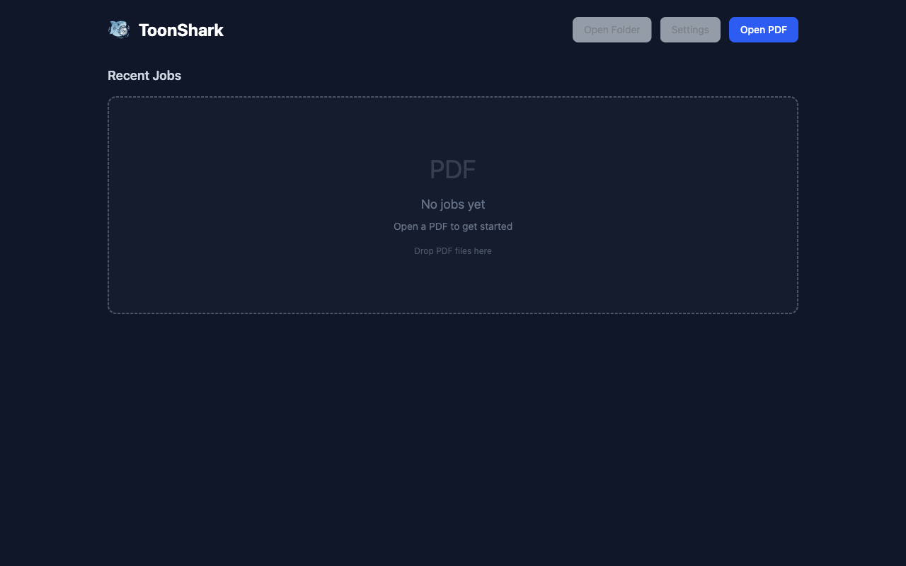

---

## 2. 설치 및 실행

### 설치 파일로 설치

| OS | 파일 형식 | 설명 |
|----|----------|------|
| macOS (Apple Silicon & Intel) | `.dmg` | 드래그 앤 드롭으로 Applications에 설치 |
| Windows x64 | `.exe` | NSIS 설치 프로그램 실행 |

### 소스에서 빌드

```bash
git clone https://github.com/user/toonshark.git
cd toonshark
npm install
npm run dev
```

> **요구 사항:** Node.js >= 24, npm >= 11

---

## 3. 홈 화면

앱을 실행하면 홈 화면이 표시됩니다. 여기서 PDF를 열거나, 최근 작업 내역을 확인할 수 있습니다.

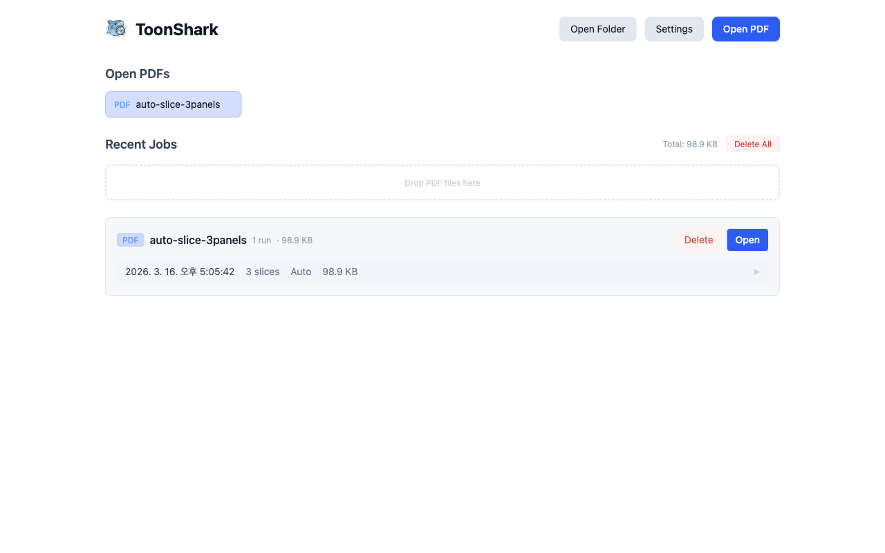

### 상단 헤더

| 버튼 | 기능 |
|------|------|
| **폴더 열기** | 작업 데이터가 저장된 기본 디렉토리를 파일 탐색기에서 엽니다 |
| **설정** | 설정 페이지로 이동합니다 |
| **PDF 열기** | 파일 선택 대화상자에서 PDF를 선택하여 워크스페이스로 이동합니다 |

### PDF 드래그 앤 드롭

PDF 파일을 홈 화면 어디에나 드래그하면 파란색 오버레이가 나타납니다. 파일을 놓으면 자동으로 워크스페이스가 열립니다. 여러 PDF를 한 번에 드롭할 수도 있습니다.

<!-- 이미지: 드래그 앤 드롭 오버레이 (실제 드래그 중에만 표시되어 자동 캡처 불가) -->

### 열린 PDF

현재 세션에서 열린 PDF 목록이 표시됩니다. 클릭하면 해당 PDF의 워크스페이스로 이동하고, **x** 버튼으로 닫을 수 있습니다. 처리 중인 PDF에는 회전 아이콘이 표시됩니다.

### 최근 작업

이전에 실행한 작업들이 PDF별로 그룹화되어 표시됩니다.

각 PDF 그룹에는:
- PDF 이름과 실행 횟수
- 저장 용량
- **삭제** 버튼 — 해당 PDF의 모든 작업 삭제
- **열기** 버튼 — 해당 PDF를 워크스페이스에서 열기

각 작업 항목에는:
- 생성 시간
- 슬라이스 수, 모드(자동/고정)
- 저장 용량
- 클릭하면 작업 상세 페이지로 이동

### 저장 용량 경고

전체 저장 용량이 10GB를 초과하면 상단에 경고 배너가 나타납니다. **정리하기** 버튼으로 모든 작업을 삭제할 수 있습니다.

---

## 4. 워크스페이스

PDF를 열면 진입하는 메인 작업 화면입니다. 왼쪽의 옵션 패널과 오른쪽의 결과 패널로 나뉩니다.

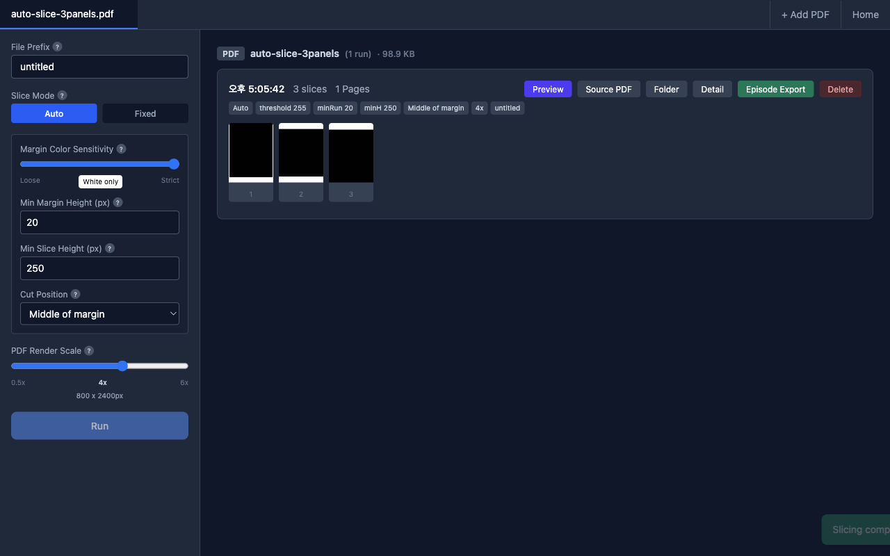

### 4.1 PDF 탭

상단에 현재 열린 PDF들이 탭으로 표시됩니다.

- 탭 클릭 — 해당 PDF로 전환
- **x** 버튼 — 탭 닫기 (PDF 제거)
- **+ PDF 추가** — 새 PDF를 추가
- **홈** — 홈 화면으로 이동
- 처리 중인 PDF에는 회전 아이콘 표시

여러 PDF를 동시에 열어서 탭 간 전환하며 작업할 수 있습니다.

### 4.2 옵션 패널

왼쪽 사이드바(272px)에 슬라이스 관련 모든 설정이 있습니다.

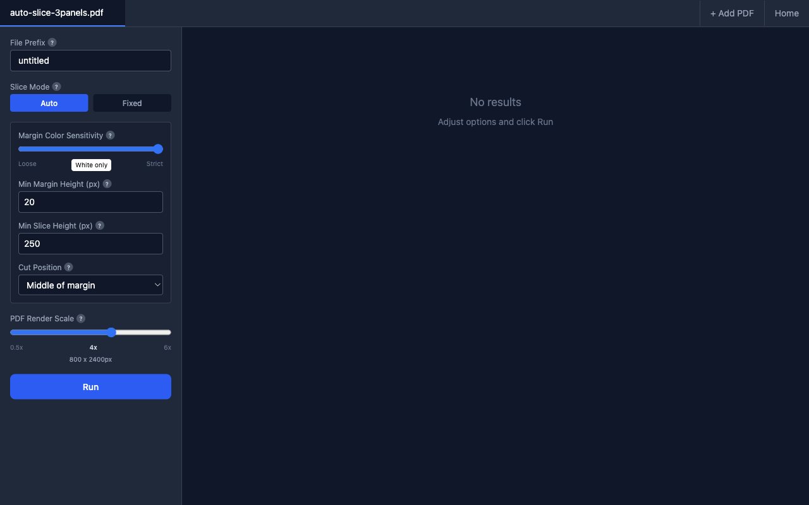

#### 파일 접두사

출력 파일명 앞에 붙는 이름입니다. PDF 파일명에서 자동 생성되며, 한글도 사용 가능합니다.

> 예: 접두사가 `ep01`이면 → `ep01_0001.png`, `ep01_0002.png`, ...

#### 분할 모드

**자동** 또는 **고정** 모드를 선택합니다. 각 모드의 세부 옵션은 [5. 슬라이스 모드](#5-슬라이스-모드)에서 설명합니다.

#### PDF 렌더 스케일

PDF를 이미지로 변환할 때의 배율입니다.

| 값 | 설명 |
|----|------|
| 1.0x | 원본 크기 |
| 2.0x | 2배 해상도 |
| 4.0x | 4배 해상도 (기본값) |
| 8.0x | 8배 해상도 (최대) |

값이 높을수록 선명하지만 처리 시간이 길어집니다. PDF의 원래 페이지 크기가 표시되어 결과 해상도를 미리 확인할 수 있습니다.

#### 실행 버튼

설정을 마친 후 **실행** 버튼을 클릭하면 슬라이스 작업이 시작됩니다.

- 동일한 설정으로 이미 실행한 작업이 있으면 중복 감지 토스트가 표시됩니다
- 처리 중에는 진행 상태가 표시됩니다:
  - PDF 복사 → 페이지 수 확인 → 페이지 렌더링 → 이미지 분할 → 미리보기 생성 → 완료

<!-- 이미지: 진행 표시줄 (처리 중 순간 캡처 필요) -->

#### 오류 표시

작업 실패 시 빨간색 오류 메시지 박스가 나타납니다.

### 4.3 결과 패널

오른쪽 영역에 실행 결과가 표시됩니다.


결과가 없으면 "결과가 없습니다" 메시지가 표시됩니다.

작업이 완료되면 **작업 결과 카드**가 생성됩니다:

- **생성 시간**, 슬라이스 수, 페이지 수
- **옵션 요약 태그** — 사용된 설정을 한눈에 확인
- **빠른 액션 버튼:**

| 버튼 | 기능 |
|------|------|
| **미리보기** | 기기 미리보기 페이지로 이동 |
| **원본 PDF** | 원본 PDF 파일 열기 |
| **폴더** | 작업 디렉토리 열기 |
| **상세** | 작업 상세 페이지로 이동 |
| **에피소드 내보내기** | 내보내기 페이지로 이동 |
| **삭제** | 이 작업 삭제 |

- **슬라이스 썸네일** — 최대 12개 표시, 클릭하면 슬라이스 뷰어로 이동

---

## 5. 슬라이스 모드

### 5.1 자동 모드

흰색 여백(패널 사이의 빈 공간)을 분석하여 자동으로 자르기 경계를 찾습니다. 대부분의 웹툰에 적합합니다.


| 옵션 | 설명 | 범위 |
|------|------|------|
| **여백 색상 민감도** | 여백으로 인식할 색상 범위. "엄격"은 순수 흰색만, "느슨"은 약간 회색도 포함 | 230–255 |
| **최소 여백 높이** | 이 높이(px) 이상의 연속 흰색 행만 컷 경계로 인식 | 1–500 |
| **최소 슬라이스 높이** | 분할된 슬라이스의 최소 높이. 너무 작은 조각 방지 | 0–2000 |
| **자르기 위치** | "여백 중앙": 흰색 영역 정중앙에서 자름. "색상 직전": 그림이 시작되는 바로 위에서 자름 | 선택 |

**팁:**
- 대부분의 경우 여백 색상 민감도는 **엄격 (255)** 을 권장합니다
- 패널 사이 여백이 좁은 웹툰은 **최소 여백 높이**를 낮게 설정하세요
- **색상 직전** 자르기 위치는 슬라이스 상단에 불필요한 여백이 남지 않아 깔끔합니다

### 5.2 고정 모드

설정한 높이(px)로 균일하게 분할합니다. 여백이 없거나 불규칙한 원고에 유용합니다.

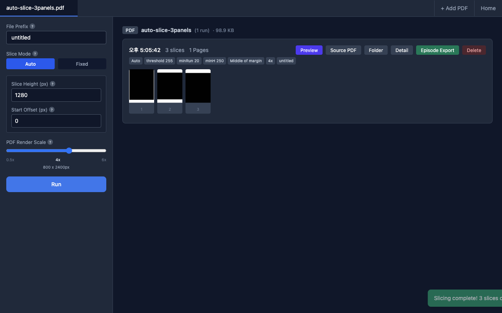

| 옵션 | 설명 | 범위 |
|------|------|------|
| **슬라이스 높이** | 각 슬라이스의 고정 높이 (px) | 100–5000 |
| **시작 오프셋** | 이미지 상단에서 이 픽셀만큼 건너뛴 후 분할 시작. 상단 여백/헤더 제외용 | 0+ |

---

## 6. 작업 상세 페이지

특정 작업의 상세 정보를 확인하는 페이지입니다.

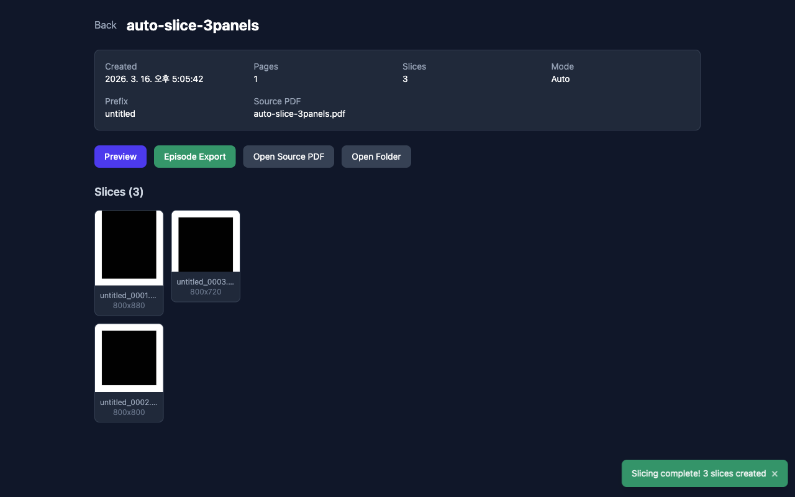

### 메타 정보

| 항목 | 설명 |
|------|------|
| 생성일 | 작업 생성 날짜 및 시간 |
| 페이지 | 원본 PDF의 페이지 수 |
| 슬라이스 | 생성된 슬라이스 이미지 수 |
| 모드 | 사용된 슬라이스 모드 (자동/고정 간격) |
| 접두사 | 파일명에 사용된 접두사 |
| 원본 PDF | 원본 PDF 파일 경로 |

### 액션 버튼

| 버튼 | 기능 |
|------|------|
| **미리보기** | 기기 미리보기 페이지로 이동 |
| **에피소드 내보내기** | 내보내기 페이지로 이동 |
| **원본 PDF 열기** | 원본 PDF 파일을 기본 앱으로 열기 |
| **폴더 열기** | 작업 디렉토리를 파일 탐색기에서 열기 |

### 슬라이스 썸네일 갤러리

생성된 모든 슬라이스가 그리드로 표시됩니다. 각 썸네일에는 파일명과 크기(px)가 표시되며, 클릭하면 슬라이스 뷰어로 이동합니다.

---

## 7. 슬라이스 뷰어

개별 슬라이스를 전체 화면으로 확인하는 뷰어입니다.

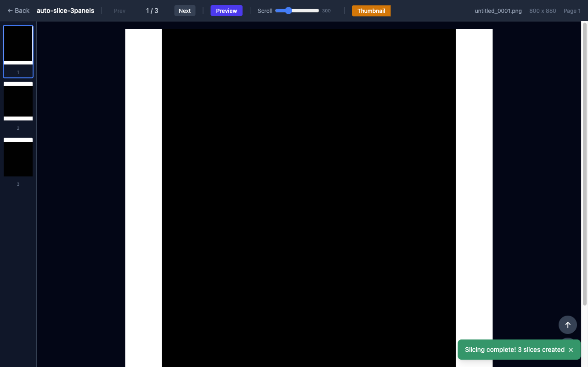

### 레이아웃

- **상단 바** — 탐색 컨트롤, 미리보기 버튼, 스크롤 속도 조절, 썸네일 캡처 버튼, 파일 정보
- **좌측 사이드바** — 전체 슬라이스 썸네일 목록 (클릭으로 이동)
- **중앙 뷰어** — 선택된 슬라이스의 원본 크기 이미지

### 탐색

| 조작 | 기능 |
|------|------|
| **이전/다음** 버튼 | 이전/다음 슬라이스로 이동 |
| 좌측 썸네일 클릭 | 해당 슬라이스로 이동 |
| **← →** 키 | 이전/다음 슬라이스 |
| **↑ ↓** 키 | 이미지 위/아래 스크롤 |
| **Esc** 키 | 이전 페이지로 돌아가기 |

### 스크롤 속도

상단 바의 슬라이더로 **↑ ↓** 키 및 스크롤 버튼의 이동량(50–1000px)을 조절할 수 있습니다.

### 스크롤 버튼

화면 우하단에 **↑** **↓** 원형 버튼이 있습니다. 클릭하면 설정된 스크롤 속도만큼 이미지가 이동합니다.

---

## 8. 썸네일 캡처

슬라이스 뷰어에서 특정 영역을 크롭하여 플랫폼 규격의 썸네일을 생성할 수 있습니다.

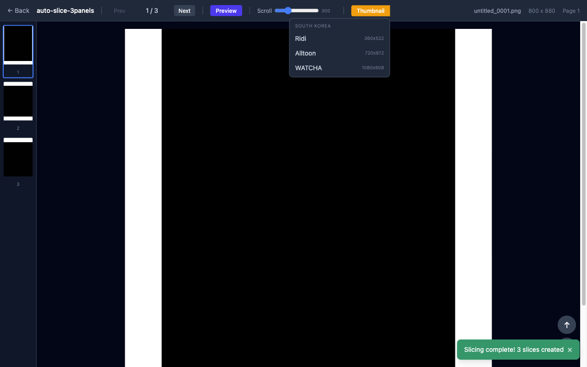

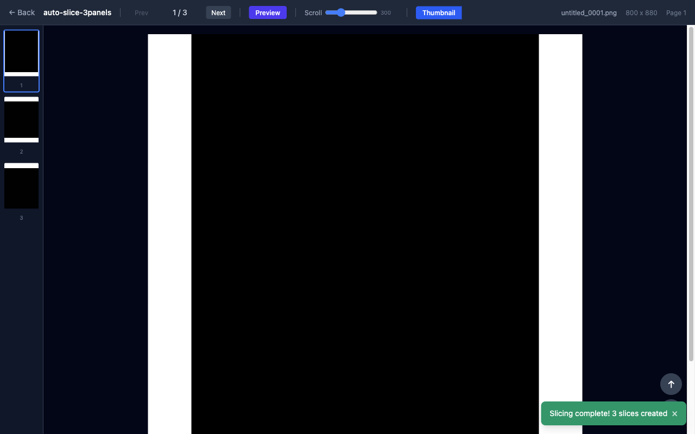

### 사용 방법

1. 슬라이스 뷰어에서 **썸네일** 버튼을 클릭합니다
2. 드롭다운에서 플랫폼을 선택합니다 (예: 리디 360x522)
3. 이미지 위에 크롭 박스가 나타납니다
4. 크롭 박스를 **드래그**하여 위치를 조정합니다
5. **모서리 핸들**을 드래그하여 크기를 조정합니다 (비율 고정)
6. **저장** 버튼을 클릭하여 썸네일을 생성합니다

### 크롭 박스 조작

| 조작 | 기능 |
|------|------|
| 중앙 영역 드래그 | 크롭 박스 위치 이동 |
| 모서리(NW/NE/SW/SE) 드래그 | 크기 조정 (플랫폼 비율 유지) |
| **저장** 버튼 | 크롭 영역을 썸네일로 저장 |
| **취소** 버튼 또는 Esc | 크롭 모드 종료 |

### 결과

- 썸네일이 저장되면 성공 토스트가 표시됩니다
- 원본 해상도가 목표 크기보다 작은 경우, 업스케일되었다는 안내가 함께 표시됩니다
- **📂** 버튼이 나타나며, 클릭하면 저장된 폴더를 열 수 있습니다

---

## 9. 기기 미리보기

웹툰이 실제 모바일 기기에서 어떻게 보이는지 시뮬레이션합니다.

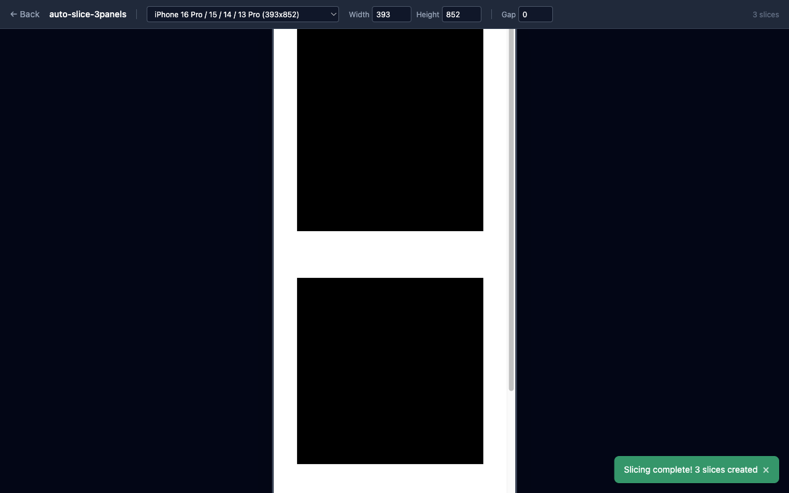

### 기기 선택

상단 드롭다운에서 미리 설정된 기기를 선택합니다.

기본 제공 기기 예시:
- iPhone 16 Pro (393×852)
- iPhone 16 Pro Max (430×932)
- Samsung Galaxy S25 (393×852)
- Samsung Galaxy S25 Ultra (412×915)
- 기타 (설정에서 추가/편집 가능)

### 커스텀 크기

너비와 높이를 직접 입력하여 원하는 뷰포트 크기를 테스트할 수 있습니다.

### 이미지 간격

**간격** 입력란에서 슬라이스 사이의 간격(px)을 조절할 수 있습니다. 기본값은 0입니다.

### 미리보기 영역

- 선택한 기기 크기의 흰 배경 뷰포트가 화면 중앙에 표시됩니다
- 뷰포트 내에서 스크롤하여 전체 웹툰을 확인합니다
- 슬라이스 이미지들이 뷰포트 너비에 맞춰 표시됩니다

---

## 10. 에피소드 내보내기

슬라이스된 이미지를 각 플랫폼의 규격에 맞춰 변환·내보냅니다.

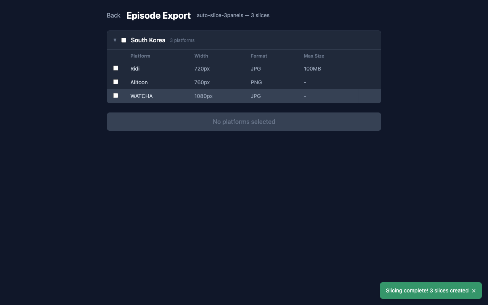

### 플랫폼 선택

국가별로 플랫폼이 그룹화되어 있습니다.

| 플랫폼 | 너비 | 형식 | 최대 파일 크기 |
|--------|------|------|---------------|
| 리디 | 720px | JPG | 100MB |
| 올툰 | 760px | PNG | - |
| 왓챠 | 1080px | JPG | - |

- **체크박스**로 내보낼 플랫폼을 선택합니다
- 국가 레벨 체크박스로 해당 국가의 모든 플랫폼을 한 번에 선택할 수 있습니다
- 이미 내보낸 플랫폼은 회색으로 표시되고, 내보내기 날짜가 표시됩니다

### 내보내기 실행

1. 원하는 플랫폼을 체크합니다
2. **내보내기 실행** 버튼을 클릭합니다
3. 진행 상태가 표시됩니다
4. 완료되면 결과가 표시됩니다:
   - 플랫폼별 파일 수
   - 경고 사항 (파일 크기 초과 등)
   - **내보내기 폴더 열기** 버튼

<!-- 이미지: 내보내기 완료 결과 (실제 내보내기 실행 후 캡처 필요) -->

### 내보내기 히스토리

이전에 내보낸 기록이 하단에 표시됩니다. 각 항목에서 내보내기 폴더를 열 수 있습니다.

### 내보내기 결과 위치

내보내기된 파일은 작업 디렉토리 내 `export/{국가}/{플랫폼}/` 경로에 저장됩니다.

---

## 11. 설정

홈 화면의 **설정** 버튼 또는 직접 `/settings` 경로로 접근합니다.

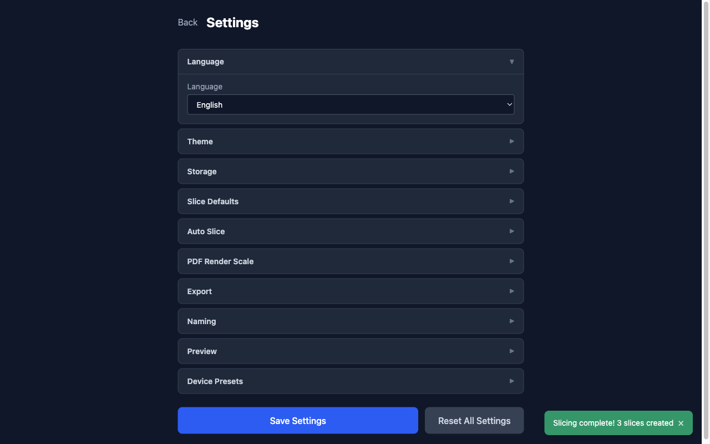

설정은 아코디언 형태의 접기/펼치기 섹션으로 구성되어 있습니다.

### 11.1 언어

| 옵션 | 설명 |
|------|------|
| English | 영어 UI |
| 한국어 | 한국어 UI |

### 11.2 테마

| 옵션 | 설명 |
|------|------|
| 라이트 | 밝은 테마 |
| 다크 | 어두운 테마 |
| 시스템 | OS 설정에 따라 자동 전환 |

### 11.3 저장소

- **기본 디렉토리** — 모든 작업 데이터가 저장되는 경로
- **찾아보기** — 디렉토리 변경 (기존 데이터는 이동되지 않음)
- **열기** — 현재 디렉토리를 파일 탐색기에서 열기

### 11.4 분할 기본값

- **기본 높이 (px)** — 고정 모드에서 사용할 기본 슬라이스 높이 (100–5000)

### 11.5 자동 분할

워크스페이스에서 자동 모드를 사용할 때의 기본값입니다.

| 옵션 | 설명 |
|------|------|
| 여백 색상 민감도 | 여백 인식 범위 (230–255) |
| 최소 여백 높이 (px) | 컷 경계 인식 최소 높이 (1–500) |
| 최소 슬라이스 높이 (px) | 생성될 슬라이스 최소 높이 (0–2000) |
| 자르기 위치 | 여백 중앙 / 색상 직전 |

### 11.6 PDF 렌더 스케일

PDF를 이미지로 변환할 때의 기본 배율입니다 (1.0x–8.0x). 워크스페이스에서 개별 조정 가능합니다.

### 11.7 내보내기

- **JPG 품질** — 에피소드 내보내기 및 썸네일 캡처에 사용되는 JPEG 압축 품질 (60–100)

### 11.8 파일명

| 옵션 | 설명 |
|------|------|
| 기본 접두사 | 새 PDF를 열 때 사용할 기본 접두사 |
| 번호 자릿수 | 파일 번호 패딩 (예: 4 → `0001`, 2 → `01`) |

### 11.9 미리보기

| 옵션 | 설명 |
|------|------|
| 이미지 간격 (px) | 미리보기에서 슬라이스 사이 간격 |
| 스크롤 속도 (px) | 슬라이스 뷰어의 스크롤 이동량 (50–1000) |

### 11.10 디바이스 프리셋

기기 미리보기에서 사용할 기기 목록을 관리합니다.

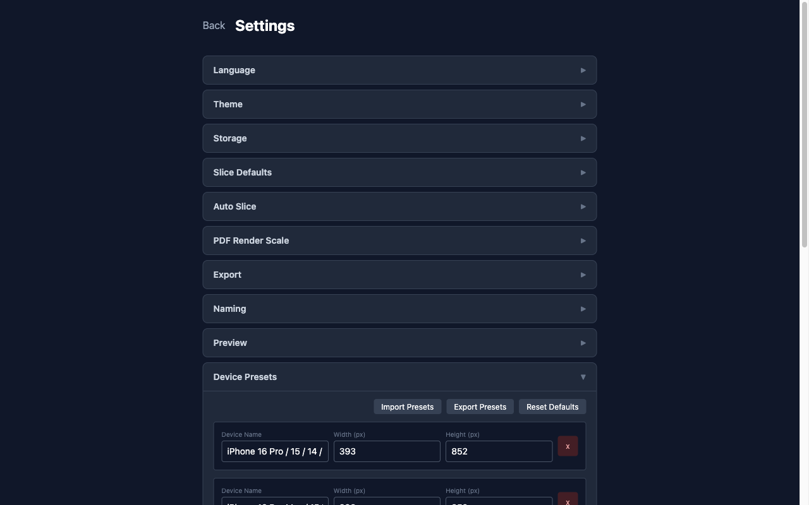

#### 기기 편집

각 기기에는 **이름**, **너비(px)**, **높이(px)** 를 설정합니다. **x** 버튼으로 삭제할 수 있습니다.

#### 기기 추가

**디바이스 추가** 버튼으로 새 기기를 추가합니다. 기본값은 393×852px입니다.

#### 가져오기 / 내보내기

| 버튼 | 기능 |
|------|------|
| **프리셋 가져오기** | JSON 파일에서 기기 프리셋 불러오기 |
| **프리셋 내보내기** | 현재 기기 프리셋을 JSON 파일로 저장 |
| **기본값 복원** | 내장 기본 기기 목록으로 초기화 |

#### 저장

설정을 변경한 후 반드시 하단의 **설정 저장** (또는 **변경사항 저장**) 버튼을 클릭해야 합니다. 변경사항이 있으면 버튼이 주황색으로 깜빡입니다.

**전체 설정 초기화** 버튼으로 모든 설정을 기본값으로 되돌릴 수 있습니다 (기본 디렉토리는 유지).

> 저장하지 않고 페이지를 나가려 하면 확인 대화상자가 표시됩니다.

---

## 12. 단축키

### 슬라이스 뷰어

| 키 | 기능 |
|----|------|
| `←` | 이전 슬라이스 |
| `→` | 다음 슬라이스 |
| `↑` | 이미지 위로 스크롤 |
| `↓` | 이미지 아래로 스크롤 |
| `Esc` | 뒤로 가기 (크롭 모드 중이면 크롭 취소) |

### 전역

| 동작 | 설명 |
|------|------|
| PDF 드래그 앤 드롭 | 홈 화면/워크스페이스에서 PDF 파일 추가 |

---

## 13. 플랫폼 프리셋 커스터마이징

`resources/defaults/countries.json` 파일을 편집하여 새 플랫폼을 추가하거나 기존 플랫폼을 수정할 수 있습니다.

### 구조

```json
[
  {
    "id": "kr",
    "platforms": [
      {
        "id": "ridi",
        "episode": {
          "width": 720,
          "format": "jpg",
          "maxFileSizeMB": 100
        },
        "thumbnail": {
          "width": 360,
          "height": 522,
          "format": "jpg",
          "maxFileSizeMB": 2
        }
      }
    ]
  }
]
```

### 필드 설명

| 필드 | 설명 |
|------|------|
| `id` (국가) | 국가 식별자 (예: `kr`, `jp`) |
| `id` (플랫폼) | 플랫폼 식별자 (예: `ridi`, `kakao_webtoon`) |
| `episode.width` | 에피소드 이미지의 목표 너비 (px) |
| `episode.format` | 출력 형식 (`jpg` 또는 `png`) |
| `episode.maxFileSizeMB` | 파일당 최대 크기 (MB). `null`이면 제한 없음 |
| `thumbnail.width` | 썸네일 너비 (px) |
| `thumbnail.height` | 썸네일 높이 (px) |
| `thumbnail.format` | 썸네일 형식 (`jpg` 또는 `png`) |
| `thumbnail.maxFileSizeMB` | 썸네일 최대 크기 (MB). `null`이면 제한 없음 |

> `thumbnail` 필드는 선택 사항입니다. 없으면 해당 플랫폼의 썸네일 캡처 기능이 비활성화됩니다.

---

## 14. FAQ

### Q: 슬라이스 결과가 너무 많이 나옵니다
**A:** 자동 모드에서 **최소 슬라이스 높이**를 높이거나, **최소 여백 높이**를 높여보세요. 작은 여백이 컷 경계로 인식되지 않게 됩니다.

### Q: 슬라이스 경계에 흰색 줄이 남습니다
**A:** 자르기 위치를 **색상 직전**으로 변경해보세요. 여백 중앙 대신 그림이 시작되는 바로 위에서 잘라 깔끔한 결과를 얻을 수 있습니다.

### Q: 이미지가 흐릿합니다
**A:** PDF 렌더 스케일을 높여보세요. 기본값은 4.0x이며, 최대 8.0x까지 설정할 수 있습니다. 값이 높을수록 처리 시간이 길어집니다.

### Q: 내보내기한 파일이 플랫폼 용량 제한을 초과합니다
**A:** 설정에서 **JPG 품질**을 낮추거나, 슬라이스 높이를 줄여 개별 파일 크기를 작게 만드세요. 내보내기 결과에 경고가 표시됩니다.

### Q: 저장 위치를 변경하고 싶습니다
**A:** 설정 → 저장소 → 찾아보기에서 새 디렉토리를 선택하세요. 기존 데이터는 자동으로 이동되지 않으므로 필요 시 수동으로 복사하세요.

### Q: 새로운 플랫폼을 추가하고 싶습니다
**A:** `resources/defaults/countries.json` 파일을 편집하여 새 플랫폼을 추가하세요. [13. 플랫폼 프리셋 커스터마이징](#13-플랫폼-프리셋-커스터마이징) 섹션을 참조하세요.

### Q: 기기 미리보기에 원하는 기기가 없습니다
**A:** 설정 → 디바이스 프리셋에서 **디바이스 추가** 버튼으로 원하는 기기의 뷰포트 크기를 추가하세요.
